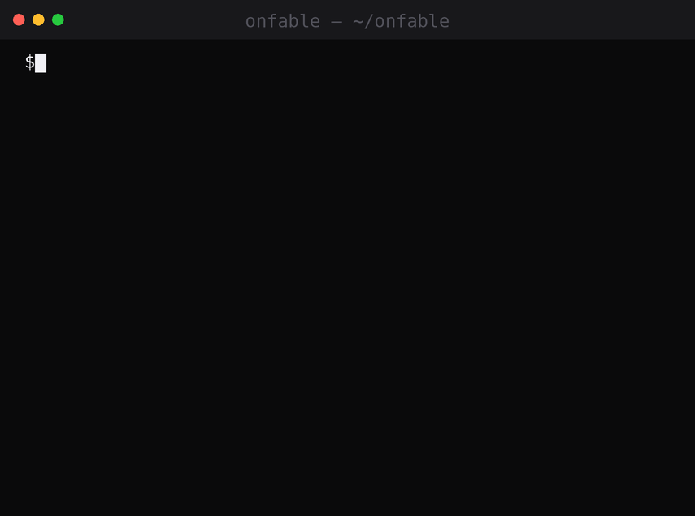
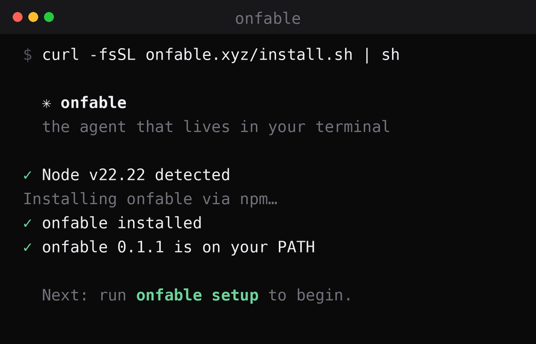

<div align="center">


**Your machine. Your agent. Your story.**

The open-source autonomous AI agent that lives in your terminal —
it runs commands, edits files, browses the web, and remembers you.

[](https://www.npmjs.com/package/onfable)
[](https://www.npmjs.com/package/onfable)
[](https://nodejs.org)
[](https://github.com/onfable/onfable/actions/workflows/ci.yml)
[](LICENSE)
[](CONTRIBUTING.md)

[**onfable.xyz**](https://onfable.xyz) · [X/Twitter](https://x.com/onfable) · [Install](#install) · [Quickstart](#quickstart) · [Features](#features) · [Architecture](#architecture) · [Contributing](CONTRIBUTING.md)

<br/>



<br/>

</div>

---

## What it looks like

One sentence in. Real work out — with your approval on every command. Next session, it already knows how you like things done.

```console
$ onfable

  ✳ onfable — your machine, your agent, your story

› organize my downloads folder by file type

  ⚒ list_dir: ~/Downloads → 38 lines
  ⚒ run_command: mkdir -p Images Docs Archives Installers
    ✓ approved
  ⚒ run_command: mv *.png *.jpg Images/ && mv *.pdf Docs/ …
    ✓ approved

Done — 34 files sorted into Images (19), Docs (9), Archives (4), and Installers (2).

  ⚒ memory_save: user likes Downloads organized by file type
```

## Why onfable?

|  | Chatbot | IDE copilot | **onfable** |
|---|:---:|:---:|:---:|
| Tells you the commands | ✅ | ✅ | ✅ |
| **Runs them for you** | ❌ | partial | ✅ |
| Edits any file on your machine | ❌ | in-project | ✅ |
| Searches & reads the web | varies | ❌ | ✅ no key needed |
| Remembers you across sessions | ❌ | ❌ | ✅ plain markdown |
| Your choice of model/provider | ❌ | ❌ | ✅ Claude, OpenAI, OpenRouter, local |
| Approval gate on every action | — | — | ✅ (or `--yolo`) |
| Open source, runs 100% locally | ❌ | ❌ | ✅ MIT |

## Install

**macOS / Linux**

```sh
curl -fsSL https://onfable.xyz/install.sh | sh
```

**Windows (PowerShell)**

```powershell
irm onfable.xyz/install.ps1 | iex
```

**npm (any platform, Node ≥ 20)**

```sh
npm install -g onfable
```

<div align="center">

</div>

## Quickstart

```sh
onfable setup    # pick a provider (Anthropic / OpenAI / OpenRouter / Bankr / custom), paste your key
onfable          # interactive chat — ask it to do things
```

One-shot tasks:

```sh
onfable run "organize my downloads folder by file type"
onfable run "find every TODO in this repo and write them to TODO.md" --yolo
```

Go onchain (optional):

```sh
onfable mcp add base   # authorize an agentic wallet in your browser
```

In the REPL: `/help` lists commands, `/new` resets the session, `/memory` shows what it remembers about you, `/exit` quits. Flags: `--yolo` skips approval prompts, `--model <id>` overrides the model for one session. Other commands: `onfable config`, `onfable mcp list|add|login|remove`.

## Features

- **Runs 100% locally** — your API key, files, and history never leave your machine (`~/.onfable/`).
- **Any model** — Claude (default, up to **Claude Fable 5** — a fable running onfable, the name wrote itself), OpenAI, OpenRouter, [Bankr LLM Gateway](https://docs.bankr.bot/llm-gateway/overview/), or any OpenAI-compatible endpoint (Ollama, LM Studio, vLLM…).
- **Real tools** — shell commands, file read/write/edit, directory listing, web search, web fetch.
- **MCP servers** — connect [Model Context Protocol](https://modelcontextprotocol.io) servers and the agent gains their tools. Ships with [Base](https://www.base.org/agents): `onfable mcp add base` for onchain wallet, USDC transfers, swaps, and DeFi — authorized in your browser via an agentic wallet (no private keys in onfable).
- **Approval-first** — every shell command, file write, and MCP tool shows you exactly what it wants to do and waits for your yes. `--yolo` when you trust it.
- **Persistent memory** — durable notes about you in plain markdown, injected into every session.
- **Hackable** — MIT licensed, lean TypeScript. A new tool is ~40 lines in [`packages/cli/src/tools/`](packages/cli/src/tools/).

### Onchain with Base

```sh
onfable mcp add base        # opens your browser to authorize an agentic wallet
onfable                     # then just ask:
›  what's my Base wallet balance?
›  send 5 USDC to vitalik.base.eth
```

Every onchain action still asks for your approval first.

## Architecture

```
onfable (CLI)
   │
   ├── commands/        setup wizard · chat REPL · one-shot run · mcp manager
   │
   ├── agent loop       stream → tool calls → approval → execute → repeat
   │     │              (max 25 iterations per turn)
   │     │
   │     ├── providers  Anthropic Messages API ─┐
   │     │              OpenAI-compatible API  ─┤→ one neutral stream interface
   │     │              (OpenAI/OpenRouter/Bankr/custom baseURL)
   │     │
   │     ├── tools      run_command · read/write/edit_file · list_dir
   │     │              web_search · web_fetch · memory_save/recall
   │     │
   │     └── mcp        Streamable HTTP client + browser OAuth (PKCE)
   │                    Base built in → base__send, base__swap, …
   │
   └── ~/.onfable/      config.json (0600) · memory.md · history/ · mcp/ tokens
```

## Monorepo

| Path | What it is |
|---|---|
| [`packages/cli`](packages/cli) | The `onfable` npm package — the agent itself |
| [`apps/web`](apps/web) | [onfable.xyz](https://onfable.xyz) — Next.js site, serves the install scripts |
| [`promo`](promo) | Remotion compositions for release videos (outside the workspace) |
| [`scripts`](scripts) | Generators for social assets and synthesized soundtracks |
| [`assets`](assets) | Rendered media: demo GIF, release videos, brand stinger |

### Develop

```sh
pnpm install
pnpm build              # build everything
pnpm typecheck          # CI mirror
pnpm dev:web            # site on localhost:3000
pnpm dev:cli            # rebuild CLI on change

# try your local CLI build
node packages/cli/dist/index.js --help
```

### Deploy the website (Vercel)

1. Import `onfable/onfable` in Vercel.
2. Set **Root Directory** to `apps/web` and enable **"Include files outside the Root Directory"** (the pnpm lockfile lives at the repo root).
3. Framework (Next.js) and install command are auto-detected.
4. Add the `onfable.xyz` domain.
5. Verify the installer is live: `curl -sI https://onfable.xyz/install.sh` → `200` with `text/x-shellscript`.

### Releasing the CLI

```sh
cd packages/cli
# bump "version" in package.json
pnpm build
npm publish --access public
```

The published tarball contains only `dist/` and the README (`files` allowlist).

## Troubleshooting

| Symptom | Fix |
|---|---|
| `onfable: command not found` after npm install | Your npm global bin isn't on PATH. Run `npm prefix -g` and add `<that>/bin` to your shell profile (Windows: reopen the terminal). |
| `EACCES` on `npm install -g` | Don't sudo. Point npm at a user-writable prefix: `npm config set prefix ~/.npm-global` and add `~/.npm-global/bin` to PATH. |
| "Could not validate" in `onfable setup` | Wrong key, no credit on the provider account, or a typo'd model id. You can save anyway and fix later with `onfable setup`. |
| Agent says search is unavailable | The no-key DuckDuckGo endpoint is occasionally rate-limited; it recovers on its own. `web_fetch` with a direct URL always works. |
| Want to start completely fresh | `rm -rf ~/.onfable` removes config, memory, and history. |

## Roadmap

- [x] CLI agent: shell, files, web, persistent memory (`v0.1.0`)
- [x] Multi-provider: Claude (incl. Fable 5), OpenAI, OpenRouter, Bankr, custom (`v0.1.1`–`v0.1.2`)
- [x] MCP support with Base built in — wallet, USDC, swaps, DeFi (`v0.1.3`)
- [ ] Contributor bounty program paid in $ONFABLE
- [ ] Telegram & Discord channel adapters
- [ ] Markdown rendering in the terminal
- [ ] Scheduled tasks ("every morning, summarize my inbox")
- [ ] Subagents for parallel work
- [ ] Hosted onfable — cloud agents, cross-device memory sync, sandboxed backends

Full phased roadmap at [onfable.xyz/#roadmap](https://onfable.xyz/#roadmap). Want something sooner? [Open an issue](https://github.com/onfable/onfable/issues) or upvote an existing one — order follows demand.

## $ONFABLE

The onfable ecosystem token on Base, launched via [Virtuals Protocol](https://app.virtuals.io/virtuals/86251) — contract [`0xeC76…dc5D`](https://basescan.org/token/0xeC76Ee25C41B51927b24b173622547A8dC89dc5D) (always verify). Live utility today: the agent itself can hold and transfer it via the built-in Base MCP. Bounties, roadmap governance, and hosted-feature access are planned — details and status labels at [onfable.xyz/#token](https://onfable.xyz/#token).

The software is and will remain free and open source — **no token is required to use onfable**. Nothing here is financial advice.

## Contributing

Contributions of every size are welcome — a new tool is ~40 lines, a typo fix is one. Start with [CONTRIBUTING.md](CONTRIBUTING.md), or grab anything labeled [`good first issue`](https://github.com/onfable/onfable/issues?q=is%3Aissue+is%3Aopen+label%3A%22good+first+issue%22).

If onfable saved you some typing today, a ⭐ helps other people find it.

## License

[MIT](LICENSE) — go build your own story.

<div align="center">
<sub><a href="https://onfable.xyz">onfable.xyz</a> · <a href="https://x.com/onfable">@onfable</a></sub>
<br/>
<sub>onfable is an independent open-source project, not affiliated with or endorsed by Anthropic, OpenAI, or any model provider.</sub>
</div>
